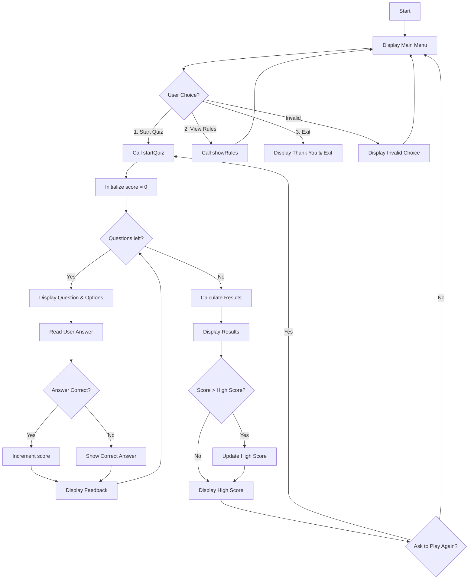
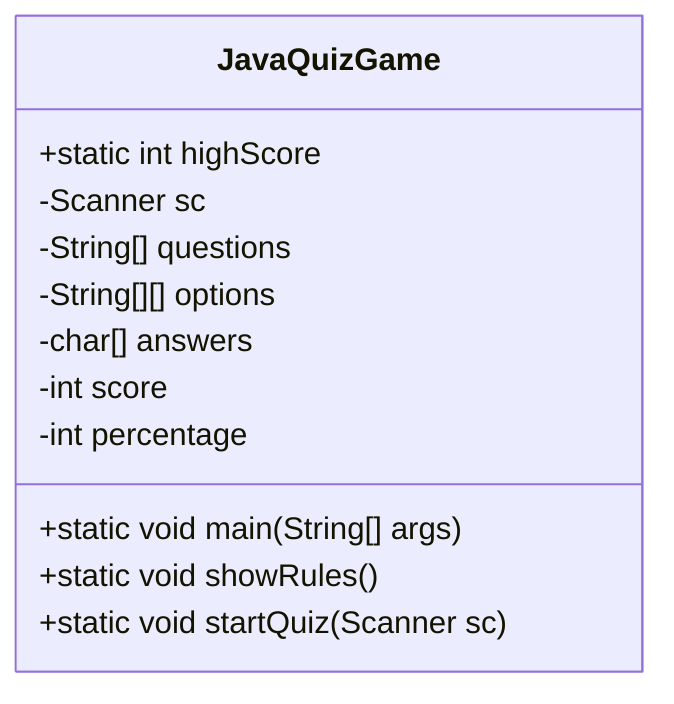

# Java Quiz Game

## 1. Project Title
Java Quiz Game

## 2. Introduction
The Java Quiz Game is a console-based interactive quiz application developed in Java. It tests users' knowledge of Java programming concepts through a series of multiple-choice questions. The game features a user-friendly menu, scoring system, high score tracking, and the ability to retry the quiz.

## 3. Detailed Project Description
This project implements a simple yet engaging quiz game that runs entirely in the console. Users can navigate through a main menu to start the quiz, view the rules, or exit the application. The quiz consists of 10 carefully crafted questions covering fundamental Java topics such as language history, syntax, and key concepts. After completing the quiz, users receive their score, percentage, and performance feedback. The application tracks the highest score achieved and allows users to retake the quiz immediately.

## 4. Theory and Java Concepts Used
The Java Quiz Game demonstrates several core Java programming concepts:

- **Classes and Objects**: The program is structured around a single class `JavaQuizGame` that encapsulates all functionality. This demonstrates object-oriented programming principles.

- **Static Variables and Methods**: The `highScore` variable is declared as static to maintain its value across multiple quiz attempts. All methods are static, allowing them to be called without creating an instance of the class.

- **Arrays**: The program uses one-dimensional arrays for storing questions and correct answers, and a two-dimensional array for storing multiple-choice options. This showcases array manipulation and data organization.

- **Control Flow Statements**: 
  - `while` loop for the main menu navigation
  - `for` loops for iterating through questions and displaying options
  - `if-else` statements for menu choices, answer validation, and result categorization

- **Input Handling**: The `Scanner` class is used to read user input from the console, demonstrating input/output operations in Java.

- **String Manipulation**: Methods like `toUpperCase()` and `charAt()` are used to process user answers, showing string handling techniques.

- **Recursion**: The `startQuiz` method calls itself when the user chooses to retry, illustrating recursive method calls.

- **Basic Arithmetic Operations**: Used for calculating scores and percentages.

## 5. Features of the Project
- Interactive console-based menu system
- 10 multiple-choice questions on Java programming
- Real-time feedback for each answer
- Comprehensive scoring system with percentage calculation
- Performance categorization (Excellent, Good, Needs Improvement)
- High score tracking across sessions
- Retry functionality without restarting the program
- Clear rules display
- Input validation for menu choices

## 6. Algorithm (Step-by-Step)
1. Initialize high score to 0
2. Create a Scanner object for user input
3. Enter main menu loop:
   a. Display menu options (Start Quiz, View Rules, Exit)
   b. Read user's menu choice
   c. If choice is 1 (Start Quiz):
      i. Initialize score to 0
      ii. Loop through each of the 10 questions:
         - Display question number and text
         - Display the 4 multiple-choice options
         - Read user's answer and convert to uppercase
         - Compare with correct answer
         - If correct, increment score and display "Correct Answer!"
         - If incorrect, display "Wrong Answer!" and show correct answer
      iii. Calculate percentage: (score * 100) / total questions
      iv. Display quiz results (correct answers, wrong answers, score, percentage)
      v. Display performance message based on percentage
      vi. Update high score if current score is higher
      vii. Display current high score
      viii. Ask if user wants to play again
      ix. If yes, recursively call startQuiz; if no, return to main menu
   d. If choice is 2 (View Rules):
      i. Display quiz rules
   e. If choice is 3 (Exit):
      i. Display thank you message
      ii. Break out of main menu loop
   f. If invalid choice, display error message
4. Close the Scanner object

## 7. Flowchart of the Program


## 8. System Architecture Diagram


## 9. Complete Java Program Code
```java
import java.util.Scanner;

public class JavaQuizGame {

    static int highScore = 0;

    public static void main(String[] args) {

        Scanner sc = new Scanner(System.in);

        while (true) {

            System.out.println("\n================================");
            System.out.println("         JAVA QUIZ GAME");
            System.out.println("================================");
            System.out.println("1. Start Quiz");
            System.out.println("2. View Rules");
            System.out.println("3. Exit");

            System.out.print("Enter your choice: ");
            int choice = sc.nextInt();

            if (choice == 1) {
                startQuiz(sc);
            }
            else if (choice == 2) {
                showRules();
            }
            else if (choice == 3) {
                System.out.println("Thank you for playing!");
                break;
            }
            else {
                System.out.println("Invalid choice!");
            }
        }

        sc.close();
    }

    public static void showRules() {

        System.out.println("\n------ QUIZ RULES ------");
        System.out.println("1. Total 10 Questions");
        System.out.println("2. Each correct answer = 1 mark");
        System.out.println("3. No negative marking");
        System.out.println("4. Enter option A/B/C/D");
        System.out.println("------------------------");
    }

    public static void startQuiz(Scanner sc) {

        int score = 0;

        String questions[] = {
                "Who developed Java?",
                "Which keyword is used for inheritance in Java?",
                "Which method is entry point of Java program?",
                "Java is platform independent because of?",
                "Which company owns Java now?",
                "Which keyword creates an object?",
                "Which is not primitive datatype?",
                "Which loop runs at least once?",
                "Which symbol ends a statement?",
                "Which package contains Scanner class?"
        };

        String options[][] = {
                {"A. James Gosling","B. Dennis Ritchie","C. Guido van Rossum","D. Bjarne Stroustrup"},
                {"A. implement","B. extends","C. inherit","D. using"},
                {"A. start()","B. main()","C. run()","D. init()"},
                {"A. JVM","B. OS","C. Hardware","D. Compiler"},
                {"A. Microsoft","B. IBM","C. Oracle","D. Google"},
                {"A. make","B. new","C. object","D. create"},
                {"A. int","B. float","C. boolean","D. String"},
                {"A. for","B. while","C. do-while","D. foreach"},
                {"A. :","B. ;","C. .","D. #"},
                {"A. java.io","B. java.util","C. java.lang","D. java.awt"}
        };

        char answers[] = {'A','B','B','A','C','B','D','C','B','B'};

        for(int i = 0; i < questions.length; i++) {

            System.out.println("\n--------------------------------");
            System.out.println("Question " + (i+1) + " of " + questions.length);
            System.out.println(questions[i]);

            for(int j = 0; j < 4; j++) {
                System.out.println(options[i][j]);
            }

            System.out.print("Enter your answer: ");
            char userAnswer = sc.next().toUpperCase().charAt(0);

            if(userAnswer == answers[i]) {
                System.out.println("Correct Answer!");
                score++;
            }
            else {
                System.out.println("Wrong Answer!");
                System.out.println("Correct Answer: " + answers[i]);
            }
        }

        int percentage = (score * 100) / questions.length;

        System.out.println("\n================================");
        System.out.println("          QUIZ RESULT");
        System.out.println("================================");

        System.out.println("Correct Answers: " + score);
        System.out.println("Wrong Answers: " + (questions.length - score));
        System.out.println("Score: " + score + "/" + questions.length);
        System.out.println("Percentage: " + percentage + "%");

        if(percentage >= 80)
            System.out.println("Result: Excellent! You are a Java Expert!");
        else if(percentage >= 50)
            System.out.println("Result: Good! Keep practicing.");
        else
            System.out.println("Result: Needs Improvement.");

        if(score > highScore) {
            highScore = score;
        }

        System.out.println("High Score: " + highScore);

        System.out.println("\nDo you want to play again?");
        System.out.println("1. Yes");
        System.out.println("2. No");

        int retry = sc.nextInt();

        if(retry == 1) {
            startQuiz(sc);
        }
    }
}
```

## 10. Multiple Sample Outputs

### Sample Output 1: Starting the Quiz and Answering All Questions Correctly
```
================================
         JAVA QUIZ GAME
================================
1. Start Quiz
2. View Rules
3. Exit
Enter your choice: 1

--------------------------------
Question 1 of 10
Who developed Java?
A. James Gosling
B. Dennis Ritchie
C. Guido van Rossum
D. Bjarne Stroustrup
Enter your answer: A
Correct Answer!

... (Questions 2-10 with correct answers)

================================
          QUIZ RESULT
================================
Correct Answers: 10
Wrong Answers: 0
Score: 10/10
Percentage: 100%
Result: Excellent! You are a Java Expert!
High Score: 10

Do you want to play again?
1. Yes
2. No
```

### Sample Output 2: Viewing Rules
```
================================
         JAVA QUIZ GAME
================================
1. Start Quiz
2. View Rules
3. Exit
Enter your choice: 2

------ QUIZ RULES ------
1. Total 10 Questions
2. Each correct answer = 1 mark
3. No negative marking
4. Enter option A/B/C/D
------------------------
```

### Sample Output 3: Quiz with Mixed Answers (Score: 7/10)
```
================================
         JAVA QUIZ GAME
================================
1. Start Quiz
2. View Rules
3. Exit
Enter your choice: 1

--------------------------------
Question 1 of 10
Who developed Java?
A. James Gosling
B. Dennis Ritchie
C. Guido van Rossum
D. Bjarne Stroustrup
Enter your answer: A
Correct Answer!

--------------------------------
Question 2 of 10
Which keyword is used for inheritance in Java?
A. implement
B. extends
C. inherit
D. using
Enter your answer: B
Correct Answer!

... (Some correct, some wrong answers)

================================
          QUIZ RESULT
================================
Correct Answers: 7
Wrong Answers: 3
Score: 7/10
Percentage: 70%
Result: Good! Keep practicing.
High Score: 7

Do you want to play again?
1. Yes
2. No
```

### Sample Output 4: Exiting the Game
```
================================
         JAVA QUIZ GAME
================================
1. Start Quiz
2. View Rules
3. Exit
Enter your choice: 3
Thank you for playing!
```

## 11. Explanation of How the Program Works
The Java Quiz Game operates as follows:

1. **Initialization**: The program starts by declaring a static `highScore` variable and entering the `main` method.

2. **Main Menu Loop**: A `while(true)` loop displays the main menu with three options. User input is read using a `Scanner` object.

3. **Menu Handling**: Based on the user's choice:
   - Choice 1 calls `startQuiz(sc)`
   - Choice 2 calls `showRules()`
   - Choice 3 displays a thank you message and breaks the loop
   - Invalid choices show an error message

4. **Quiz Execution**: In `startQuiz()`:
   - Arrays store questions, options, and answers
   - A `for` loop iterates through each question
   - User answers are compared to correct answers
   - Score is incremented for correct answers
   - Feedback is provided immediately

5. **Result Calculation**: After all questions, percentage is calculated, and results are displayed with appropriate messages.

6. **High Score Tracking**: The current score is compared to the static `highScore`, updating it if necessary.

7. **Retry Option**: Users can choose to retake the quiz, which recursively calls `startQuiz()`.

8. **Resource Management**: The `Scanner` is closed when the program exits.

The program demonstrates modular design with separate methods for different functionalities, making it easy to maintain and extend.

## 12. Conclusion
The Java Quiz Game successfully demonstrates fundamental Java programming concepts in an interactive and educational format. By implementing core features like user input handling, data storage with arrays, control flow, and object-oriented principles, the project serves as an excellent learning tool for Java beginners. The modular structure, scoring system, and user-friendly interface make it both functional and engaging. This project can be further enhanced by adding features like timed questions, different difficulty levels, or a graphical user interface using JavaFX or Swing.</content>
<parameter name="filePath">c:\Users\Admin\Documents\GitHub\JAVA-PROGRAMMING\JavaQuizGame_README.md